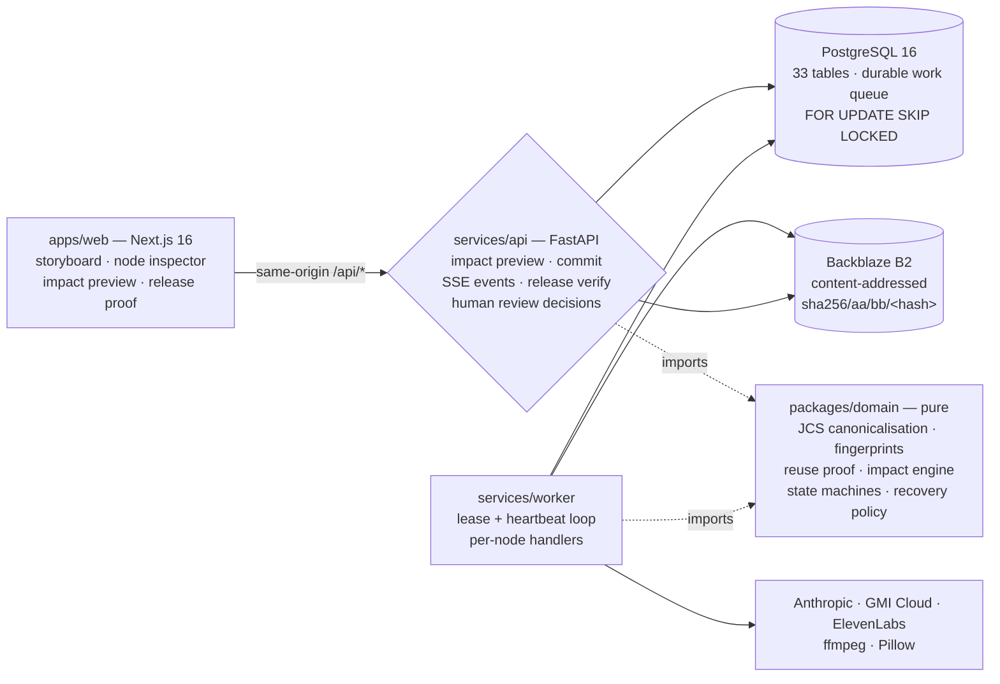

<div align="center">


# TAKEGRAPH


-F5C451)


### The self-healing build system for generative media. **Rebuild only what changed.**

A sixteen-second product film is eighteen generated assets. Change one line of legal copy the day before launch and almost every pipeline regenerates all eighteen — not because the work is wrong, but because nothing in the system knows what that change actually touched. TAKEGRAPH treats a production as a **dependency graph**: every output is content-addressed and fingerprinted from its own recipe and its exact inputs, so the system can *prove* which work survived. One word of legal copy changes → **4 nodes rebuild, 14 are reused, 2 provider calls instead of 12.** When a provider times out mid-build it **recovers itself** and keeps going. And every claim is checkable — hitting verify re-downloads every byte from object storage and re-hashes it, live.

**[ Watch the demo ↗ ](#-demo)** · **[ The reuse proof ↗ ](#the-reuse-proof-seven-conditions-every-time) ** · **[ Self-healing ↗ ](#self-healing--the-recovery-ladder)** · **[ Run it locally ↗ ](#run-it-locally)**

</div>

---

## ▶ Demo

*Two minutes forty. The landing page, then a real build: eighteen nodes carrying real renders, clips and audio. Open a node and read its provenance — fingerprint, provider, model, the gates it passed. Open the clip whose provider timed out and watch the system's own record of how it recovered. Then change one line of legal copy and ask what that actually invalidated: four rebuild, fourteen reuse, each with a reason code. It closes on proof — a release re-hashing every byte it shipped, live.*

*Not a screen recording: Puppeteer drives the live application, ElevenLabs narrates, ffmpeg assembles.*

https://github.com/user-attachments/assets/79eb05f6-643d-4494-9db9-82fbc11296d7

---

## Table of contents

- [The problem](#the-problem)
- [What TAKEGRAPH is](#what-takegraph-is)
- [The numbers, measured](#the-numbers-measured)
- [Architecture](#architecture)
- [The reuse proof (seven conditions, every time)](#the-reuse-proof-seven-conditions-every-time)
- [Self-healing — the recovery ladder](#self-healing--the-recovery-ladder)
- [Controlled fault injection — labelled, never silent](#controlled-fault-injection--labelled-never-silent)
- [Release proof — verifiable by a third party](#release-proof--verifiable-by-a-third-party)
- [Durability — the parts that survive a crash](#durability--the-parts-that-survive-a-crash)
- [API](#api)
- [Engineering decisions & the hard problems](#engineering-decisions--the-hard-problems)
- [What's real vs simplified — the honesty table](#whats-real-vs-simplified--the-honesty-table)
- [Tech stack](#tech-stack)
- [Project layout](#project-layout)
- [Run it locally](#run-it-locally)
- [Tests](#tests)

---

## The problem

Generative media production has quietly inherited the worst property of pre-build-system software: **there is no dependency graph, so every change is a full rebuild.**

A campaign is not one prompt. It is a brief, a product reference, a shot plan, four keyframes, four video clips, a copy pack, narration, a music bed, an end card, a poster, and a composed delivery package — eighteen artifacts from five different providers, each depending on the ones before it. When the legal team changes four words the day before launch, the honest answer to "what do we need to regenerate?" is *four things*. The answer every pipeline gives is *all of it*.

That is expensive in three ways at once. It burns compute and provider spend regenerating work that was already correct. It burns wall-clock at exactly the moment there is none. And it silently discards the specific outputs a human already reviewed and approved — so the approval has to happen again.

The second problem is that these pipelines are **fragile in a way nobody can audit**. Providers time out. Models return schema-invalid output. A worker dies mid-submission. Most systems respond by failing the whole run, or worse, by retrying blindly and double-charging. And when someone asks "which model produced this frame, and did it pass review?", the answer lives in a Slack thread.

## What TAKEGRAPH is

A build system for generative media. The memorable flow:

<div align="center">

**`COMPILE → FINGERPRINT → PROVE REUSE → GENERATE → VALIDATE → RECOVER → RELEASE`**

</div>

1. **Compile** — a production template plus a revision's parameters compile deterministically into a graph. The same inputs always produce the same graph hash.
2. **Fingerprint** — every node gets a fingerprint derived from its own recipe (spec, provider policy, generator version) and the *selected output hashes* of its inputs. Canonicalised with [JCS / RFC 8785](https://www.rfc-editor.org/rfc/rfc8785), hashed with SHA-256.
3. **Prove reuse** — before regenerating anything, each node must fail a seven-condition proof. Reuse is the default; regeneration has to earn itself.
4. **Generate** — only the nodes that failed the proof are submitted, each with an idempotency key so a crashed worker cannot double-charge.
5. **Validate** — outputs pass quality gates before anything downstream is allowed to depend on them.
6. **Recover** — a failed attempt walks a policy ladder: same-model retry → model fallback → cross-provider fallback → fail, with budgets checked first.
7. **Release** — publication produces a manifest of SHA-256 hashes that anyone can re-verify against object storage.

The demo production, **ORBIT**, is 18 nodes and 39 edges:

| Node type | Count | Provider |
|---|---|---|
| `SOURCE_TEXT` · `SOURCE_IMAGE` | 2 | — (resolved from the revision) |
| `STRUCTURED_PLAN` · `STRUCTURED_TEXT` | 2 | Anthropic `claude-sonnet-4-6` |
| `IMAGE_GENERATION` | 4 | GMI Cloud `seedream-5.0-pro` |
| `VIDEO_GENERATION` | 4 | GMI Cloud `pixverse-v6-i2v` |
| `AUDIO_GENERATION` | 2 | ElevenLabs `eleven_multilingual_v2`, `music_v2` |
| `IMAGE_TRANSFORM` · `IMAGE_COMPOSITION` · `MEDIA_COMPOSITION` | 4 | local (Pillow / ffmpeg) |

## The numbers, measured

Every figure here came out of a real build against real providers, not an estimate.

**A full build** — `c689485c`, 18 nodes, 16 rebuilt / 2 reused, **7m 44s**, twelve provider calls across three vendors.

**An incremental change** — edit one line of legal copy on that build:

```
>>> 4 REBUILD / 14 REUSE   (2 provider calls) <<<

   rebuild  copy.pack                  NODE_SPEC_CHANGED
   rebuild  audio.narration            UPSTREAM_FINGERPRINT_CHANGED
   rebuild  graphic.end_card           UPSTREAM_FINGERPRINT_CHANGED
   rebuild  compose.delivery_package   UPSTREAM_FINGERPRINT_CHANGED
```

The legal line is bound into `copy.pack` alone ([ADR 0002](docs/decisions/0002-legal-line-is-a-bound-parameter.md)), so exactly one node's *own* spec changed and three inherited it. The four video clips, four keyframes, poster, cutout and music bed are all provably still valid — **14 of 18 nodes and 10 of 12 provider calls avoided.**

**Recovery** — build `9484ac6e`, with a provider timeout injected into `video.clip.03`:

| attempt | mechanism | model | outcome |
|---|---|---|---|
| 1 | `PRIMARY` | `pixverse-v6-i2v` | **FAILED** — `TEST_FAULT_PROVIDER_TIMEOUT`, class `TRANSIENT` |
| 2 | `SAME_PROVIDER_RETRY` | `pixverse-v6-i2v` | **SUCCEEDED**, `parent_attempt_id` linked |

The node ended `PASSED` with reason *"Transient failure; retrying the same model (1 of 2)"*. The build completed all 18 nodes in 13m 01s. No human intervened, and both attempts stay on the record.

**Verification** — a published release re-hashed from object storage: **8 assets verified in 6.7s**, manifest `e3212d8e…2bd66`.

## Architecture

Three processes, one database, and a boundary rule: **the domain package never imports the API, the worker, or a vendor SDK.**



- **`packages/domain`** is pure Python with no I/O. Canonicalisation, fingerprinting, the reuse proof, the impact engine, five state machines and the recovery decision engine live here — which is why they are testable without a database, a browser or a provider account.
- **`services/api`** is transport plus persistence. It never calls a provider.
- **`services/worker`** is the only thing that talks to providers, and the only thing that writes bytes to B2.
- **The browser never talks to a provider or to B2 directly.** It calls same-origin `/api/*`; the web tier proxies. No credential or internal hostname reaches the client.

## The reuse proof (seven conditions, every time)

Before a node can be reused, it must satisfy **all seven**. The first failure returns a reason code that the UI shows verbatim — a rebuild is never unexplained.

| # | Condition | Rejection code |
|---|---|---|
| 1 | A previous build produced this node | `CACHE_MISS` |
| 2 | Its fingerprint equals the proposed fingerprint | `NODE_SPEC_CHANGED` / `UPSTREAM_FINGERPRINT_CHANGED` |
| 3 | The previous attempt reached an accepted state | `CACHE_MISS` |
| 4 | A selected output exists | `CACHE_ASSET_MISSING` |
| 5 | Its assets are present in B2 | `CACHE_ASSET_MISSING` |
| 6 | Those bytes are verified — re-read and re-hashed, never trusted from the record | `CACHE_ASSET_UNVERIFIED` |
| 7 | Required quality gates are current, and the node is not revoked or a fixture | `CACHE_VALIDATION_STALE` |

Condition 2 is where the leverage is. A fingerprint covers the node's own spec, its provider policy, the generator code version, *and the selected output hashes of every input* — so invalidation cascades exactly as far as the change actually reaches and no further. Nodes being rebuilt in the same plan advertise a `pending:` placeholder ref, which is how a change propagates through the graph in one pass instead of requiring a fixed-point loop.

## Self-healing — the recovery ladder

A failed attempt does not fail the build. `decide_recovery()` is a pure function — no clock, no database — that returns the next move:

```
budget exhausted?            → FAIL   (BUDGET_EXCEEDED)
deterministic error class?   → FAIL   (INPUT · AUTH · POLICY · VALIDATION never retry)
retryable, budget remains?   → RETRY_SAME_MODEL          (cheapest recovery first)
same-provider fallback model → FALLBACK_MODEL            (model-specific fault)
cross-provider fallback      → FALLBACK_PROVIDER         (credential must be present)
otherwise                    → FAIL   (RECOVERY_EXHAUSTED)
```

Details that matter:

- **Deterministic errors are never retried.** A schema-invalid input or a content-policy denial produces the same failure on a second submission and costs money to discover that.
- **A cross-provider fallback whose credential is missing is skipped with the variable named**, not silently. Policies store `${GMI_VIDEO_FALLBACK_MODEL}`-style placeholders resolved at decision time; an unset variable stays literal so "not configured" can never be mistaken for "configured as empty."
- **Every recovery attempt links to its parent** (`parent_attempt_id`), so the inspector shows a chain rather than a set of unrelated tries.
- **Recovery intent is re-derived from persisted state**, not read off the queue payload — Postgres is authoritative, and a payload can be stale or lost while a node's status and attempt history cannot.

## Controlled fault injection — labelled, never silent

Demonstrating self-healing requires making something fail on purpose, which is exactly the kind of feature that becomes a lie. Two independent guards are required before a fault can be injected: the environment must set `ALLOW_FAILURE_INJECTION=true`, **and** the target project must be demo-scoped. Rules are single-use, carry a TTL, and are consumed on fire.

Every injected attempt is stamped `is_injected_fault = true` in the database and renders as a red **`TEST FAULT`** badge in the UI — on the storyboard tile, in the node list, and in the attempt record. **A fault this system induces can never be mistaken for one a provider caused.**

## Release proof — verifiable by a third party

Publishing a release writes a manifest listing the SHA-256, byte size and media type of every selected asset, plus the build and revision it came from.

`POST /releases/{id}/verify` does not read a flag. It **re-downloads every asset from B2 and re-hashes it**, then reports how many were checked and when:

```json
{ "release_id": "a766934d-…", "verified": true, "checked_assets": 8,
  "manifest_sha256": "e3212d8eb394c53ac91f483db397d92a1d463ad0790b2f3407b51d1529d2bd66",
  "retention_mode": "NOT_CONFIGURED", "verified_at": "2026-08-03T19:26:17.989Z" }
```

Verification is deliberately open to any principal who can view the project, including a guest — *a verification claim nobody can independently re-run is worth very little*. It changes no state.

## Durability — the parts that survive a crash

- **The work queue is PostgreSQL**, claimed with `FOR UPDATE SKIP LOCKED` under a partial index. A worker takes a lease and heartbeats; a dead worker's lease expires and its item becomes claimable again. The claim predicate is written to match the partial-index predicate *verbatim*, because an OR-shaped predicate defeats Postgres's implication prover and turns the claim into a sequential scan (measured, at 50k rows).
- **Idempotency keys** are `SHA256(JCS({build_node_id, fingerprint, mechanism, provider, model, logical_attempt_slot}))` — canonicalised, never concatenated, because `a + b` lets `("ab","c")` and `("a","bc")` collide and a collision here silently drops a submission.
- **State machines are declared as transition tables** and `assert_transition` is the only thing that moves a record. The *absent* edges are the point: there is no `RUNNING → PASSED`, so nothing can skip storage and verification; `SUCCEEDED` is reachable only from `STORED`.
- **An ambiguous submission parks the node for a human** rather than guessing. If a worker dies between "sent" and "recorded", the system cannot know whether it was billed — so it stops and asks, and `POST /build-nodes/{id}/decision` is how a person answers.

## API

| Route | Purpose |
|---|---|
| `POST /api/v1/projects/{id}/change-sets` | Draft a change against a base revision |
| `POST /api/v1/change-sets/{id}/impact` | Deterministic impact preview — per-node decision + reason code |
| `POST /api/v1/impact-plans/{id}/commit` | Atomically commit a plan → revision, graph, build, queued work |
| `GET /api/v1/builds/{id}/graph` | The whole build: nodes, attempts, assets, validations, lineage |
| `GET /api/v1/builds/{id}/events` | SSE stream, resumable via `Last-Event-ID` |
| `POST /api/v1/build-nodes/{id}/decision` | Human review — `PASS` · `FAIL` · `RETAKE`, reason mandatory |
| `GET /api/v1/releases/{id}` | Release proof — every asset's SHA-256 and provenance |
| `POST /api/v1/releases/{id}/verify` | Re-download and re-hash every byte, live |
| `GET /api/v1/assets/{id}/thumbnail` | Cached, downscaled poster (content-addressed, immutable) |
| `POST /api/v1/demo/session` · `/demo/fault-rules` | Guest session · arm a labelled test fault |

Errors are one typed envelope mapped once at the boundary — `{ error: { code, message, request_id, details } }` — with a closed vocabulary including `INVALID_SOURCE`, `IMPACT_PLAN_STALE`, `BUILD_NOT_RUNNABLE`, `BUDGET_EXCEEDED`, `PROVIDER_UNAVAILABLE`, `STORAGE_UNAVAILABLE`, `ASSET_VERIFICATION_FAILED`, `HUMAN_REVIEW_REQUIRED`.

## Engineering decisions & the hard problems

The bugs that taught something. The rule I refused to break: **never claim a number I had not run.**

- **The bug that made the product's central claim false — silently.** The worker recorded a source node's output as the JCS hash of `{"brief_text": …}`; the impact engine expected the whitespace-normalised text hash. Two defensible hashes that never agree — so a resolved source node could *never* satisfy the reuse proof. Every source reported `CACHE_ASSET_MISSING`, which invalidated its dependents, and theirs. A one-word legal change rebuilt **16 of 18 nodes** instead of 4. Nothing failed while this was true; 470-odd tests passed. It was caught by checking the headline claim against a live build *before* filming it. The definition now lives once in `takegraph_domain.graph.source_content`, both callers import it, and a conformance test asserts they agree.

- **Repairing a hash necessarily invalidates everything downstream.** Fixing the source hash meant every descendant's *stored* fingerprint encoded the old value. That is correct — those nodes really were fingerprinted against a wrong hash — and it resolves on the next build. Worth stating plainly rather than papering over, because a reuse system that quietly rewrote fingerprints would be untrustworthy.

- **One handler had recovery; four didn't.** `gmi_work` grew a correct recovery branch and the other four never did, so a failed Anthropic or ElevenLabs node parked itself for recovery and then died with *"attempt is in unsupported state"*. No handler understood `RETAKE_PENDING` at all. The reason nobody noticed: **no node in the system had ever reached a second attempt**, so every path that depends on one was untested. One shared `reentry` module now serves all five.

- **`logical_attempt_slot` was always zero.** Correct only while a node never submits twice with the same mechanism, provider and model — which is exactly what a same-model retry and a repeated manual retake do. Two such attempts derived an *identical* idempotency key and would have collided on a unique constraint. Found by reading the spec against the call sites, not by a failure.

- **A denylist implemented as an allowlist.** `ErrorClass.is_retryable_same_provider` documented "never retry input, auth, policy or validation" but implemented "only retry transient and storage" — and `decide_recovery` inlined the set rather than using the property, which is how the two drifted. An unclassified provider error mapped to `INTERNAL`, was barred from the cheap retry rung, and with no fallback configured a single GMI hiccup ended a 16-node rebuild after one attempt.

- **The provider's real limit was not the documented one.** The music prompt embedded the whole shot-plan JSON and was guarded at 5,000 characters. ElevenLabs' actual limit is **4,100**, so a 4,551-character prompt passed our own check and came back `422`. Terminal — no retry policy clears a 4xx — and the build died with it. The bed now takes the brief, the length and the shot beats: 410 characters, and camera bodies were never something a music model could act on.

- **Paying twice for every byte.** `B2Store.verify` downloads an object, hashes it and throws the bytes away; callers then called `get_bytes` on the same key. Every input a node consumed cost two Class B transactions and twice the egress. `get_verified` does one download, hashes on the way through, and keeps the §8.3.7 guarantee that stored bytes are never trusted from the database record.

- **A dashboard that looked broken while behaving correctly.** Eighteen tiles pointed the browser at full-resolution originals — up to 1.6 MB each — for a box a couple of hundred pixels wide. Slow (fourteen seconds to fill), expensive (eighteen B2 transactions *per page view*, because a presigned URL can never be cached), and fragile: when the account's daily cap was reached B2 answered `403` with an XML body, and a browser told to render XML as an image draws a broken-image glyph. Now a content-addressed WebP poster cache: **first request per asset costs one B2 read, every request after costs none.** 14s → 1.16s, 18 requests → 2, ~6 MB → ~174 KB.

- **Sequential work that looked like a server error.** Release verification checked eight assets one after another — the sum of every round trip, 78 seconds on a degraded link. Long enough that the proxy in front hung up, so the browser reported *Internal Server Error* while the API was quietly succeeding. The checks are independent; only the verdict combines. **78s → 6.7s.**

- **Tests were sharing the development database.** `TEST_DATABASE_URL` was unset, so the suite fell back to `DATABASE_URL` and truncated tables between cases — wiping in-flight demo builds, and failing a *different* pair of tests each run from leftover rows. That is what made the flakiness look random rather than stateful.

- **One failed build stranded the project permanently.** Impact preview demands a successful baseline for the base revision; a failed build leaves the head revision without one, and previewing against the older revision is refused as stale. Between the two guards there was no way to build the project again, ever. Committing a revision is not undone by a failed build, so the baseline now falls back to the project's most recent successful build — reuse is decided on fingerprint identity, not revision lineage.

## What's real vs simplified — the honesty table

| Capability | Status |
|---|---|
| **Deterministic graph compilation** | Real. Same inputs → same graph hash; conformance-tested against `genblaze_core.canonical_json`. |
| **Fingerprints + seven-condition reuse proof** | Real. 485 automated tests; measured 4-rebuild / 14-reuse on a live build. |
| **Real multi-provider generation** | Real. Anthropic, GMI Cloud (image + video), ElevenLabs (TTS + music), local ffmpeg/Pillow. |
| **Content-addressed storage + byte verification** | Real. Backblaze B2, `sha256/aa/bb/<hash>` keys, re-read and re-hashed, never trusted from the record. |
| **Self-healing recovery** | Real. Ladder is a pure function with unit tests; demonstrated end-to-end on build `9484ac6e`. |
| **Labelled fault injection** | Real. Two guards required, single-use, TTL, `TEST FAULT` badge everywhere it appears. |
| **Durable queue + leases** | Real. `FOR UPDATE SKIP LOCKED`, partial index verified by `EXPLAIN` at 50k rows. |
| **Release proof + live re-verification** | Real. 8 assets re-hashed from B2 in 6.7s, open to guests. |
| **Human review decisions** | Real. `PASS` / `FAIL` / `RETAKE` with mandatory reason, audit row written in the same transaction. |
| **SSE build events** | Real. Resumable via `Last-Event-ID` against the authoritative event sequence. |
| Cost estimation | Pricing registry is empty, so estimates render `UNKNOWN` rather than a plausible guess. |
| Cross-provider fallback | Implemented and unit-tested; not exercised end-to-end (the transient rung recovered first). |
| Object Lock / retention | Read back from B2 and reported honestly as `NOT_CONFIGURED` — never assumed. |
| Deployment | **Not deployed.** Runs locally against real providers and real B2. No live URL is claimed. |
| Multi-tenant hardening | Org/project scoping enforced in the domain; not penetration-tested. |
| Not built (never faked) | Agent-driven repair · multi-region storage · pricing ingestion · public release CDN. |

## Tech stack

- **Monorepo:** `uv` workspace (Python) + pnpm (web). `packages/domain` has zero I/O dependencies by design.
- **Web:** Next.js 16.2.12 (App Router), React 19.2.8, TypeScript 7.0.2, Tailwind v4 (CSS-first `@theme`), HugeIcons through a single registry.
- **API:** Python 3.12 · FastAPI · Pydantic v2 · SQLAlchemy 2 (async) · Alembic (8 migrations, 33 tables).
- **Worker:** standalone process, lease + heartbeat, per-node-type handlers, bounded backoff on transient database faults.
- **Data:** PostgreSQL 16 · Redis · Backblaze B2 (S3-compatible, content-addressed, least-privilege scoped keys).
- **Media:** ffmpeg (composition, poster frames) · Pillow (cutout, end card, thumbnails).
- **Testing:** pytest — 485 tests across domain, infrastructure, API and worker, on an isolated `TEST_DATABASE_URL`.

## Project layout

```
packages/
  domain/          # pure: JCS canonicalisation · fingerprints · reuse proof · impact engine
                   # state machines · recovery policy · fault rules · ORBIT template
  infrastructure/  # B2 store (content-addressed) · media probe/normalise/poster · delivery
  contracts/       # shared wire contracts
services/
  api/             # FastAPI: change-sets · impact · commit · builds · SSE · review · releases
                   # thumbnails · demo · uploads · B2 webhooks · durable work queue
  worker/          # lease loop + handlers: source · plan · copy · image · video · audio
                   # local composition · delivery · recovery · attempt re-entry
apps/
  web/             # Next.js: landing · /demo workspace · /releases/[id] proof · /system/status
infra/migrations/  # Alembic
docs/decisions/    # ADRs — canonicalisation ownership, the legal line as a bound parameter
video/             # the demo film pipeline (Puppeteer → ElevenLabs → ffmpeg); gitignored
```

## Run it locally

Prerequisites: Docker, Python 3.12 + [uv](https://docs.astral.sh/uv/), Node 20+, pnpm, ffmpeg.

```bash
cp .env.example .env          # fill in provider keys + B2; TEST_DATABASE_URL matters
docker compose up -d          # PostgreSQL 16 + Redis
uv sync && uv run alembic upgrade head

uv run uvicorn takegraph_api.main:app --port 8000   # API
uv run python -m takegraph_worker                    # worker (separate shell)

cd apps/web && pnpm install && pnpm build && pnpm start -p 3002
```

Open `localhost:3002` → **Open live build** → inspect a node → **Edit legal line** → **Preview impact** and watch 4 rebuild / 14 reuse compute against your own build. Then open the release and press **Verify again**.

Warm the storyboard posters before a demo so it paints from cache and spends nothing:

```bash
uv run python scripts/warm_thumbnails.py
```

## Tests

```bash
uv run pytest -q      # 485 tests — domain · infrastructure · api · worker
uv run ruff check .
uv run mypy packages/domain/takegraph_domain packages/infrastructure/takegraph_infrastructure \
            services/api/takegraph_api services/worker/takegraph_worker scripts/doctor.py
```

The suite is behaviour-first. The domain tests need no database: canonicalisation is checked byte-for-byte against a reference implementation, the reuse proof has a case per rejection code, the state machines assert the *absent* transitions, and the recovery ladder is a pure decision table. The integration tests exercise the real queue under concurrency, a deliberately crashed worker, and the source-hash conformance that keeps the worker and the impact engine agreeing.

Set `TEST_DATABASE_URL` to a database of its own — the suite truncates between cases.
